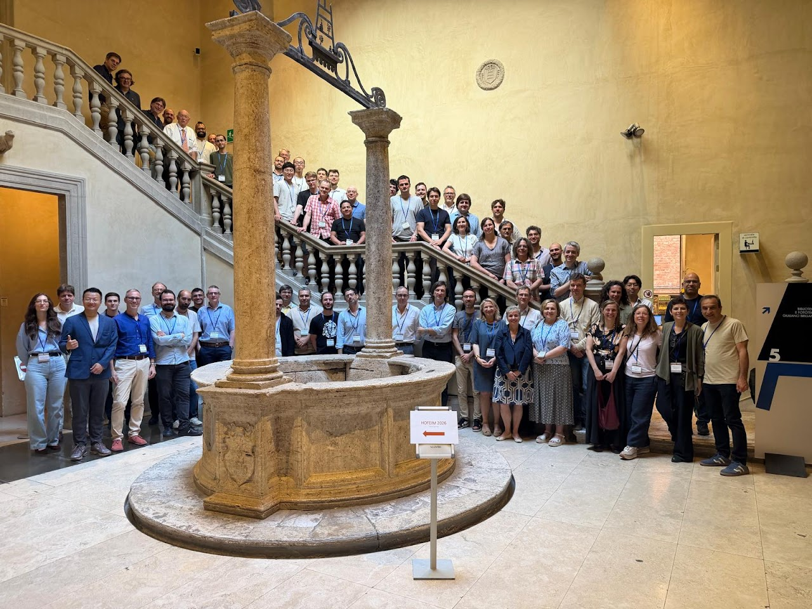
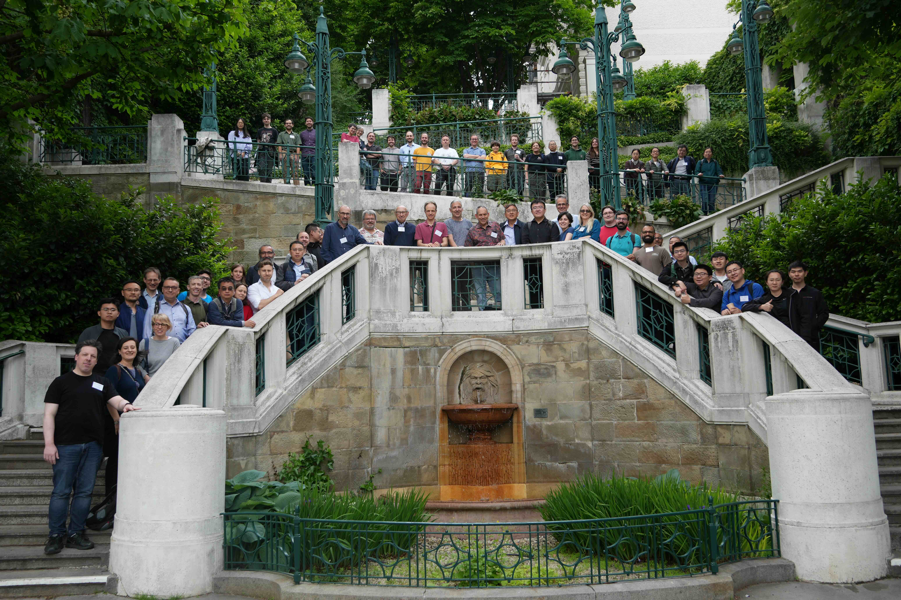
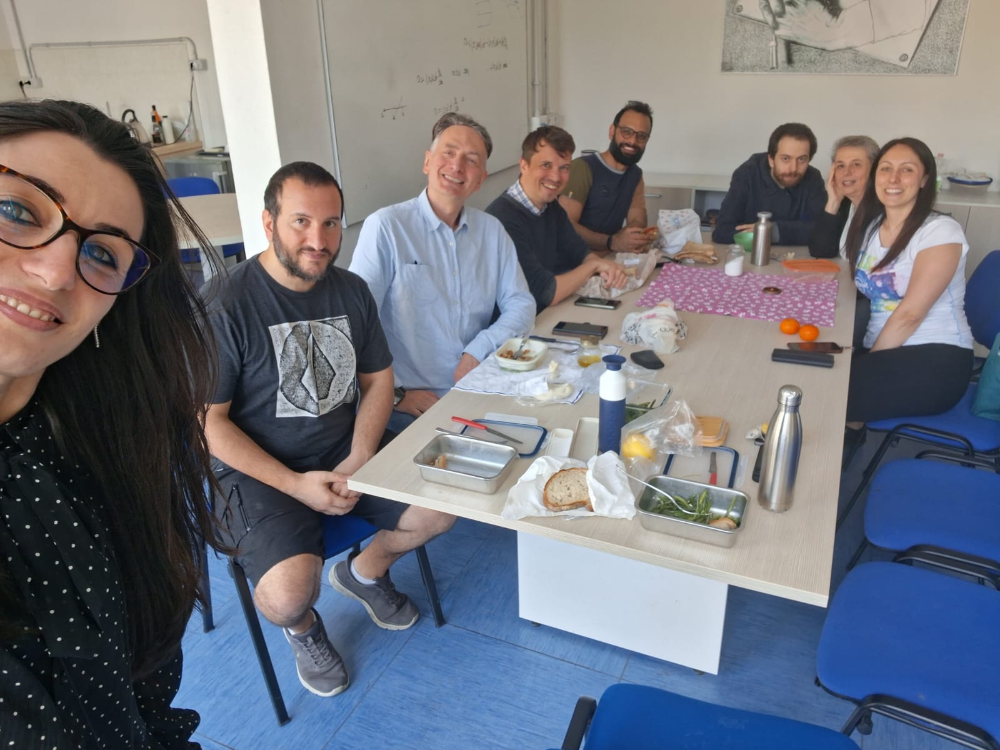
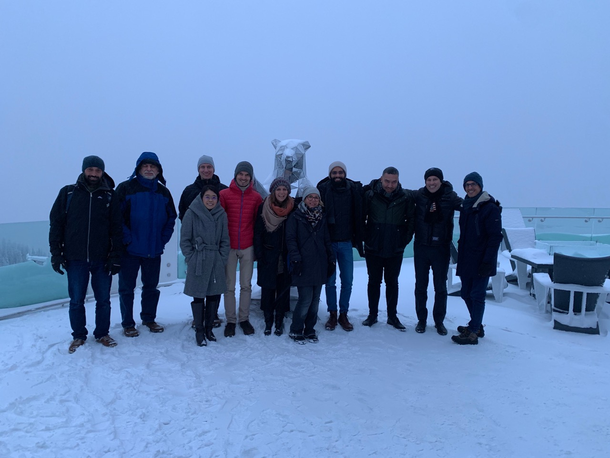
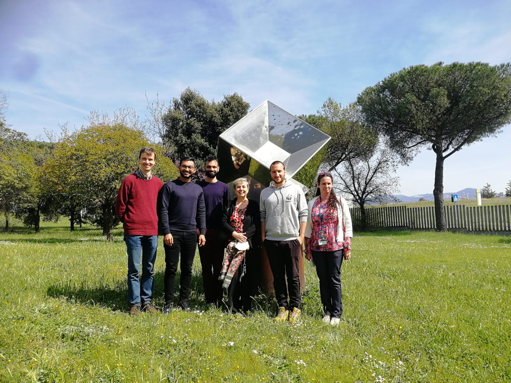
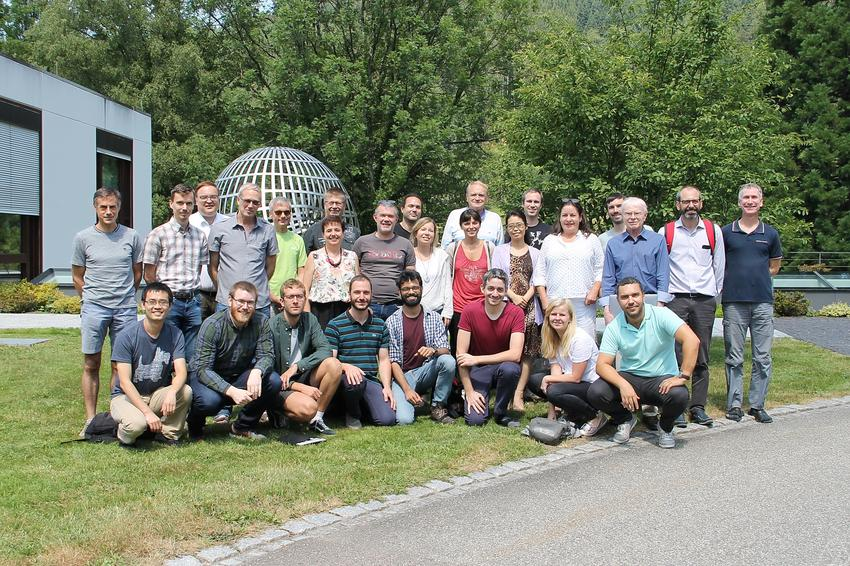
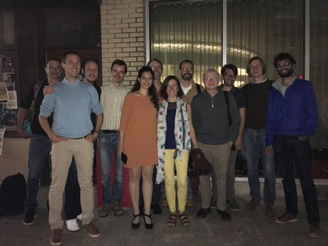

<figure>
    

    <figcaption><small>May 2026, workshop on High-Order Finite Element and Isogeometric Methods at the beautiful Santa Maria della Scala in Siena.</small></figcaption>
</figure>
<figure>
    

    <figcaption><small>May 2026, workshop on Differential Complexes at the Erwin Schrödinger Institute in Vienna.</small></figcaption>
</figure>
<figure>
    

    <figcaption><small>April 2026, a Roman lunch. From left to right: Mariarosa, Francesco, Hendrik, Deepesh, Carlo, Carla and Cristina.</small></figcaption>
</figure>
<figure>
    

    <figcaption><small>November 2022, visiting the finite element bear in Banff during the Isogeometric Analysis conference. From left to right: Rafael Vazquez, Michael Sacks, Jessica Zhang, Benjamin Marussig, Hendrik Speleers, Carlotta Giannelli, Annalisa Buffa, Deepesh Toshniwal, Angelos Mantzaflaris, Ale Reali, Thomas Elgued.</small></figcaption>
</figure>
<figure>
    

    <figcaption><small>April 2022, research visit to University of Rome Tor Vergata. From left to right: Hendrik Speleers, Krunal Raval, Deepesh Toshniwal, Carla Manni, Francesco Patrizi, Francesca Pelosi.</small></figcaption>
</figure>
<figure>
    

    <figcaption><small>July 2019, at the workshop on Mathematical Foundations of Isogeometric Analysis, Oberwolfach. From left to right: Bernard Mourrain, Xiaodong Wei, Hendrik Speleers, Trond Kvamsdal, Espen Sande, Gershon Elber, Bert Jüttler, Riccardo Puppi, Carla Manni, Ulrich Langer, Andrea Bressan, Stefano Serra-Capizzano, Deepesh Toshniwal, Helmut Harbrecht, Annalisa Buffa, Carlotta Giannelli, Tom Lyche, Thomas Takacs, Jessica Zhang, Alessandro Reali, Sandra Boschert, Angela Kunoth, John Evans, Angelos Mantzaflaris, Tom Hughes, Giancarlo Sangalli, Jörg Peters. Source: <a href="https://www.mfo.de/occasion/1929b/www_view">Mathematisches Forschungsinstitut Oberwolfach</a>. </small></figcaption>
</figure>
<figure>
    

    <figcaption><small>October 2016, Computational Mechanics Group Dinner at the legendary Asti Trattoria, Austin. From left to right:  Ben Urick, Alessandro Reali, René Hiemstra, Hendrik Speleers, Ece Ercan, Fred Nugen, Deborah Castro Mariño, Giancarlo Sangalli, Tom Hughes, Mattia Tani, Benjamin Marussig, Deepesh Toshniwal. Source: <a href="https://users.oden.utexas.edu/~hughes/">Tom Hughes</a></small></figcaption>
</figure>

