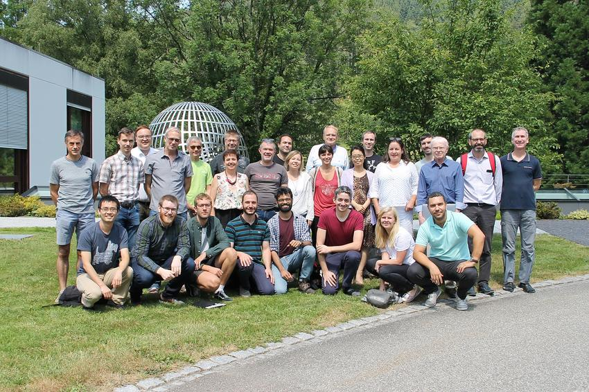
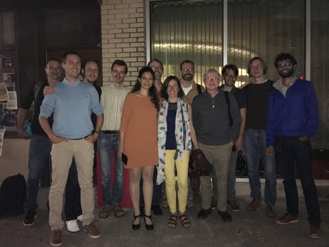

<figure>
    

    <figcaption><small>July 2019, at the workshop on Mathematical Foundations of Isogeometric Analysis, Oberwolfach. From left to right: Bernard Mourrain, Xiaodong Wei, Hendrik Speleers, Trond Kvamsdal, Espen Sande, Gershon Elber, Bert Jüttler, Riccardo Puppi, Carla Manni, Ulrich Langer, Andrea Bressan, Stefano Serra-Capizzano, Deepesh Toshniwal, Helmut Harbrecht, Annalisa Buffa, Carlotta Giannelli, Tom Lyche, Thomas Takacs, Jessica Zhang, Alessandro Reali, Sandra Boschert, Angela Kunoth, John Evans, Angelos Mantzaflaris, Tom Hughes, Giancarlo Sangalli, Jörg Peters. Source: <a href="https://www.mfo.de/occasion/1929b/www_view">Mathematisches Forschungsinstitut Oberwolfach</a>. </small></figcaption>
</figure>
<figure>
    

    <figcaption><small>October 2016, Computational Mechanics Group Dinner at the legendary Asti Trattoria, Austin. From left to right:  Ben Urick, Alessandro Reali, René Hiemstra, Hendrik Speleers, Ece Ercan, Fred Nugen, Deborah Castro Mariño, Giancarlo Sangalli, Tom Hughes, Mattia Tani, Benjamin Marussig, Deepesh Toshniwal. Source: <a href="https://users.oden.utexas.edu/~hughes/">Tom Hughes</a></small></figcaption>
</figure>

